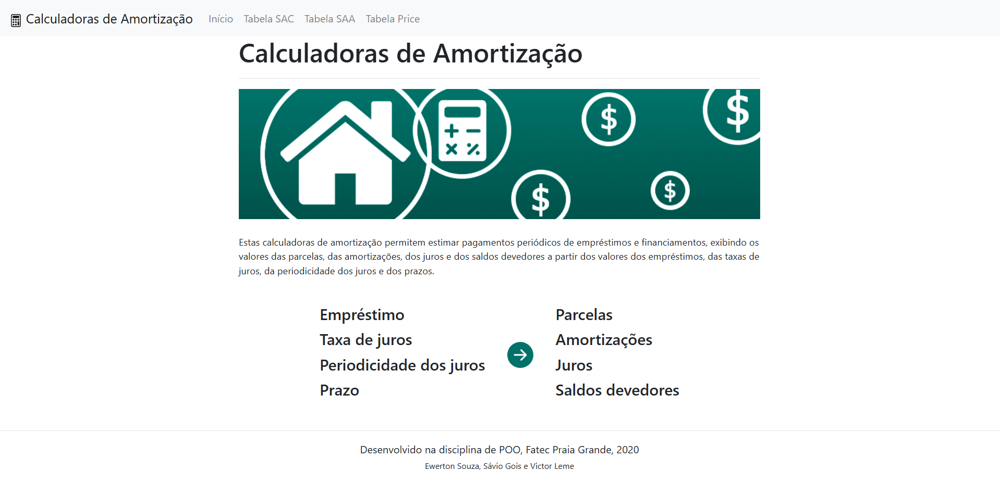
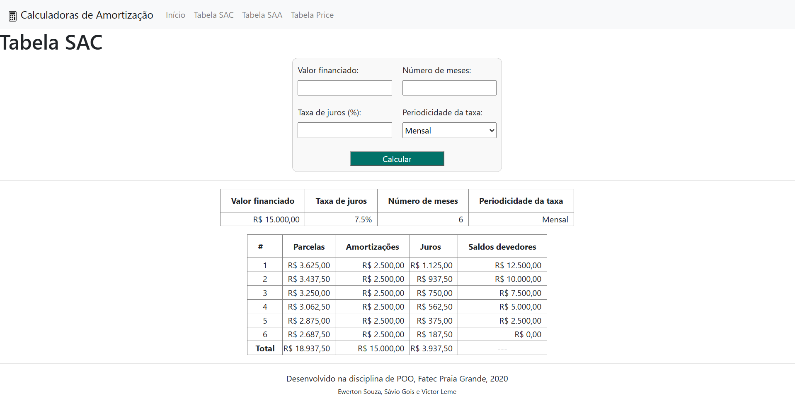
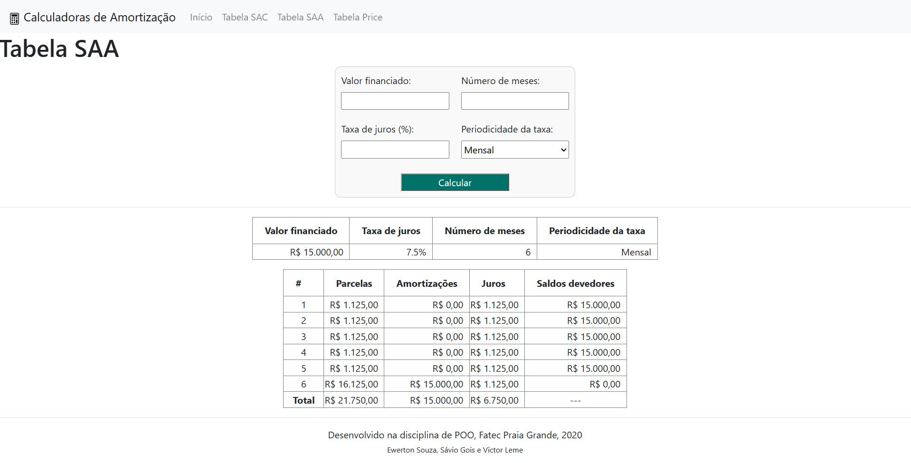

# JSP Loan Amortization Calculators (SAC, American System and Price Table)

🇬🇧 English (official) · 🇧🇷 [Leia em português](README.pt-BR.md)


Educational JSP web app with three loan amortization calculators: **SAC** (constant amortization), **SAA** (American system) and **Price table** (French system). Each one shows the installment, amortization, interest and outstanding balance of every month. It was a team project for the Object-Oriented Programming course (Fatec Praia Grande, 2020/2).

## Live demo

<https://jsp-loan-amortization-calculators.onrender.com/Proj01_Amortizacao/home.jsp>

The demo runs on Render's free plan, which sleeps after about 15 minutes without visits, so the first load can take up to a minute.

## Features

- **SAC**: the principal is repaid in equal parts, so installments start high and decrease.
- **SAA**: only interest is paid during the term and the whole principal comes in the last installment.
- **Price**: constant installments; interest falls and amortization grows over time.
- Monthly or annual interest rates (an annual rate is converted to its equivalent monthly rate).
- Input validation, so the public demo cannot be asked for absurd tables (see limits below).
- Deep links through query parameters, e.g. `amortizacao-constante.jsp?vf=100000&tj=1&nm=12&pt=1`.

## Screenshots

| Home | SAC |
| --- | --- |
|  |  |

| SAA (American system) | Price table |
| --- | --- |
|  |  |

## Tech stack

- Java Server Pages (scriptlets), Apache Tomcat 9, Java 17 (Java 11+ works)
- Bootstrap 4.5.2, jQuery and Popper loaded from CDNs; icons are inline SVG from [Bootstrap Icons](https://icons.getbootstrap.com/) (MIT)
- NetBeans/Ant project; the `lib/` folder holds NetBeans-provided libraries that keep their own licenses

## Getting started

**Docker**

```bash
docker build -t jsp-loan-amortization-calculators .
docker run --rm -p 8080:8080 jsp-loan-amortization-calculators
```

Open <http://localhost:8080/Proj01_Amortizacao/>.

**Any Tomcat 9**: copy the folder `Proj01_Amortizacao/web` to `<tomcat>/webapps/Proj01_Amortizacao` and start Tomcat.

**NetBeans**: open the folder `Proj01_Amortizacao` as a project, pick a Tomcat 9 server and run it.

## Project structure

```
Proj01_Amortizacao/
  web/                 pages, style sheet, image
    WEB-INF/jspf/      shared fragments: validation, form, summary, menu, footer
  nbproject/, lib/     NetBeans/Ant project files
docs/design/           banner.psd, Photoshop source of the banner
docs/screenshots/
Dockerfile, render.yaml
```

The interface and the file names are in Portuguese, because the project was written for a Brazilian course:

| Portuguese | English |
| --- | --- |
| `amortizacao-constante.jsp`, Tabela SAC | SAC (constant amortization) calculator |
| `amortizacao-americana.jsp`, Tabela SAA | American system calculator |
| `tabela-price.jsp`, Tabela Price | Price table (French system) calculator |
| `home.jsp`, Início | Home |
| Valor financiado (`vf`) | Financed amount |
| Taxa de juros (`tj`) | Interest rate (%) |
| Número de meses (`nm`) | Number of months |
| Periodicidade da taxa (`pt`) | Rate period: `1` monthly (Mensal), `2` annual (Anual) |
| Parcelas | Installments |
| Amortizações | Amortization (principal repaid) |
| Juros | Interest |
| Saldos devedores | Outstanding balance |

## Scope and limitations

- Educational project, not financial advice. It ignores fees, insurance and taxes.
- Limits: amount up to R$ 100,000,000, rate up to 1000%, 1 to 600 months. The Price table also refuses extreme rate and term combinations, where double-precision arithmetic would lose accuracy.
- Values are computed with `double` and rounded only when displayed, so a total can differ by a few cents from the sum of the rounded rows. The final balance is shown as zero.
- All logic lives in JSP scriptlets, with no Java classes, as in the original coursework.

## License

[MIT](LICENSE) © 2020 Ewerton Souza, Sávio Gois, Victor Leme. Bootstrap, jQuery, Popper and Bootstrap Icons are MIT-licensed; the NetBeans libraries in `Proj01_Amortizacao/lib` keep their original licenses.
